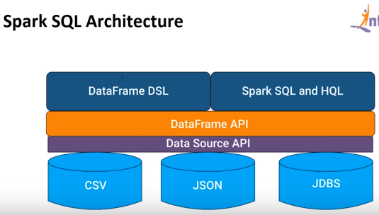

<p align="center">
    
</p>

- [Introduction](#introduction)
- [Resilient Distributed Dataset (RDD)](#resilient-distributed-dataset-rdd)
- [Architecture](#architecture)
- [3 ways to create RDDs](#3-ways-to-create-rdds)
- [Transformations on RDDs](#transformations-on-rdds)
- [Actions on RDDs](#actions-on-rdds)
- [Creating Data Frames](#creating-data-frames)
- [Spark SQL queries on data frame](#spark-sql-queries-on-data-frame)

## Introduction

Spark is

- Open source
- Scalable
- Real-time - due to in-memory computation
- Parallel
- Polyglot - Spark code can be written in Scala (most popular), Java, Python, R, and Spark SQL. It provides high-level APIs for these languages.

## Resilient Distributed Dataset (RDD)

The fundamental data structure of Spark. It has
- In-Memory Computation
- Lazy Evaluation
- Fault Tolerant
- Immutability
- Partitioning - all data chunks are divided into partitions
- Persistence - users can reuse RDD and use a storage strategy for them

## [Architecture](https://youtu.be/GFC2gOL1p9k?t=549)


- __Driver program__ - The code you're writing behaves as a "driver program". The interactive shell you're writing code in is a driver program
- __Cluster manager__ - manages various jobs.
- __Worker nodes__ - they execute a task and return it to "Spark context".

#### [Sample Cluster Managers](https://youtu.be/GFC2gOL1p9k?t=685)

- Spark Standalone Cluster
- Apache Mesos
- Hadoop Yarn
- Kubernetes

## [3 ways to create RDDs](https://youtu.be/GFC2gOL1p9k?t=794)

#### [1) parallelize an already existing collection in a driver program](https://youtu.be/GFC2gOL1p9k?t=817)

```scala
val myFirstRDD = sc.parallelize(List("spark","scala","hadoop"))
```

#### [2) refer a data set in an external storage system](https://youtu.be/GFC2gOL1p9k?t=845)

```scala
val textRDD = sc.textFile("/user/cloudera/data.txt")
```

#### [3) create an RDD from already existing RDDs](https://youtu.be/GFC2gOL1p9k?t=870)

Using `textRDD` from above, we can write:

```scala
val newRDD = textRDD.filter(x => x.contains("spark"))
```


## [Transformations on RDDs](https://youtu.be/GFC2gOL1p9k?t=908)

#### Function: `map`

```scala
val x = sc.parallelize(List("spark", "rdd", "example", "sample", "example"))
val y = x.map(x => (x, 1))
y.collect
```

Output is:

```scala
Array[(String, Int)] = Array((spark,1), (rdd, 1), (example,1), (sample,1), example,1))
```

#### Function: `flatmap`

"map returns 1 element, while flatmap can return a list of elements"

```scala
sc.parallelize(List(1,2,3)).flatMap(x=>List(x,x,x)).collect
```
Output is:

```scala
Array(1, 1, 1, 2, 2, 2, 3, 3, 3)
```

#### Function: `filter`

```scala
sc.parallelize(List(1,2,3,4,5,6,7,8,9,10))
numbers.filter(_%2==0).collect
```

Output is:

```scala
Array(2, 4, 6, 8, 10)
```

#### Function: `intersection`

```scala
val parallel = sc.parallelize(1 to 9)
val par2 = sc.parallelize(5 to 15)
parallel.intersection(par2).collect
```

Output is:

```scala
Array(6, 8, 7, 9, 5)
```


## [Actions on RDDs](https://youtu.be/GFC2gOL1p9k?t=1204)

"[Actions are Spark RDD operations that give non-RDD values](https://www.youtube.com/watch?v=GFC2gOL1p9k)"

The values of actions are stored to drivers or external storage systems

#### Function: `reduce`

```scala
val a = sc.parallelize(1 to 10)
a.reduce(_ + _)
```
Output is: `Int = 55`

```scala
val names1 = sc.parallelize(List("abe", "abby", "apple"))
names1.reduce((t1, t2) => t1 + t2)
```

Output is: `String = abeabbyapple`

#### Function: `first`

```scala
val names2 = sc.parallelize(List("apple", "beatty", "beatrice"))
names2.first
```

Output is: `String = apple`

#### Function: `take`

```scala
val nums = sc.parallelize(List(1,5,3,9,4,0,2)
nums.take(4)
```

Output is `Array[Int] = Array(1, 5, 3, 9)`

#### Function: `foreachPartition`

```scala
val b = sc.parallelize(List(1, 2, 3, 4, 5, 6, 7, 8, 9), 3)
b.foreachPartition(x => println(x.reduce(_ + _)))
```

Output is:

```scala
6
15
24
```

## [Creating Data Frames](https://youtu.be/GFC2gOL1p9k?t=1750)



- __Data Source API__ is a universal API for loading and storing structured data. Has support for Hive, JSON, etc.
- __DataFrame API__ is a distributed collection of data in the form of named columns and rows. It is equivalent to a relational table in SQL. It is lazily evaluated. Can be accessed through SQL context.
-

```scala
List(1, "mobile", 50000), (2, "shoes", 4500), (3, "TV", 70000))
val productDF = product.toDF("pid", "product", "value") // column names
productDF.show()
```

Output is:

```scala
+---+-------+-----+
|pid|product|value|
+---+-------+-----+
|  1| mobile|50000|
|  2|  shoes| 4500|
|  3|     TV|70000|
+---+-------+-----+
```

Let's print the schema:

```scala
df.printSchema()
```

Output is:
```scala

```

#### [Reading JSON file as Data frame](https://youtu.be/GFC2gOL1p9k?t=1826)


```scala
val df = spark.read.json("/student1.json")
df.printSchema()
```

```scala
+----+------+
| age|  name|
+----+------+
|null|   Sam|
|  17|  Mick|
|  18|Jennet|
|  19|Serena|
+----+------+
```

Let's print the schema:

```scala
df.printSchema()
```

Output is:

```scala
root
 |-- age: long (nullable = true)
 |-- name: long (nullable = true)
```

Let's `select` a column:

```scala
df.select("name").show()
```

Output is:

```scala
+------+
|  name|
+------+
|   Sam|
|  Mick|
|Jennet|
|Serena|
+------+
```

Let's filter for age greater than 18

```scala
df.filter($"age" >= 18).show()
```

Output is:
```scala
+----+------+
| age|  name|
+----+------+
|  18|Jennet|
|  19|Serena|
+----+------+
```

Let's group by "age"

```scala
df.groupBy("age").count().show()
```

Output is:

```scala
+----+-----+
| age|count|
+----+-----+
|  19|    1|
|null|    1|
|  17|    1|
|  19|    1|
+----+-----+
```

## [Spark SQL queries on data frame](https://youtu.be/GFC2gOL1p9k?t=1950)

#### Create or replace temp view on data frame

```scala
df.createOrReplaceTempView("student1 where age=17")
val sqlDf1 = spark.sql("SELECT * FROM student1")
sqlDF1.show()
```

Output is:

```scala
+---+----+
|age|name|
+---+----+
| 17|Mick|
+---+----+
```

## References

- [YouTube: What is Apache Spark? | Introduction to Apache Spark | Apache Spark Certification | Edureka](https://www.youtube.com/watch?v=VSbU7bKfNkA&list=PL9ooVrP1hQOGyFc60sExNX1qBWJyV5IMb) - Mediocre overview
- [YouTube: Intro to Apache Spark for Java and Scala Developers - Ted Malaska (Cloudera)](https://www.youtube.com/watch?v=x8xXXqvhZq8) - Too high-level and slightly off-topic
