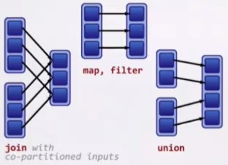

<p align="center">
    
</p>

- [Tutorial from IntelliPath](#tutorial-from-intellipath)
    - [Architecture](#architecture)
    - [Resilient Distributed Dataset (RDD)](#resilient-distributed-dataset-rdd)
        - [3 ways to create RDDs](#3-ways-to-create-rdds)
        - [Transformations on RDDs](#transformations-on-rdds)
        - [Actions on RDDs](#actions-on-rdds)
    - [Creating Data Frames](#creating-data-frames)
- [Tutorial from Coursera](#tutorial-from-coursera)
    - [Introduction](#introduction)
    - [Resilient Distributed Datasets (RDDs)](#resilient-distributed-datasets-rdds)
    - [Transformations and Actions](#transformations-and-actions)
    - [Evaluation in Spark](#evaluation-in-spark)
    - [Reduction Operations](#reduction-operations)
    - [Pair RDDs](#pair-rdds)
    - [Transformations and Actions on Pair RDDs](#transformations-and-actions-on-pair-rdds)
    - [Joins](#joins)
    - [Shuffling](#shuffling)
    - [Partitioning](#partitioning)
    - [Wide vs Narrow Dependencies](#wide-vs-narrow-dependencies)
    - [Structure and Optimization](#structure-and-optimization)
    - [Spark SQL](#spark-sql)
    - [Data Frames](#data-frames)
    - [Datasets](#datasets)
- [User Defined Functions (UDFs)](#user-defined-functions-udfs)
- [SparkException: Task not serializable](#sparkexception-task-not-serializable)
- [References](#references)

This repo is a concise summary and _replacement_ of the tutorials by IntelliPath and Coursera. Using the hyperlinks below is optional.


# [Tutorial from IntelliPath](https://www.youtube.com/watch?v=GFC2gOL1p9k)

## [Architecture](https://youtu.be/GFC2gOL1p9k?t=549)

Spark is an open source, scalable tool for parallel-processing.

Spark is polygot: code can be written in Scala (most popular), Java, Python, R, and Spark SQL. It provides high-level APIs for these languages.


- __Driver program__ - The code you're writing behaves as a "driver program". The interactive shell you're writing code in is a sample driver program.
- __Cluster manager__ - manages various jobs. Sample cluster managers: Spark Standalone Cluster, Apache Mesos, Hadoop Yarn, Kubernetes
- __Worker nodes__ - they execute a task and return it to the "Spark context". They provide in-memory storage for cached RDDs (explained below)


## Resilient Distributed Dataset (RDD)

RDDs are the fundamental data structure of Spark.

### [3 ways to create RDDs](https://youtu.be/GFC2gOL1p9k?t=794)

[1) Parallelize a collection](https://youtu.be/GFC2gOL1p9k?t=817)

```scala
val myFirstRDD = sc.parallelize(List("spark", "scala", "hadoop"))
```

[2) Use a data set in an external storage system](https://youtu.be/GFC2gOL1p9k?t=845)

```scala
val textRDD = sc.textFile("/user/cloudera/data.txt")
```

[3) Create an RDD from already existing RDDs](https://youtu.be/GFC2gOL1p9k?t=870)

Using `textRDD` from above:

```scala
val newRDD = textRDD.filter(x => x.contains("spark"))
```


### [Transformations on RDDs](https://youtu.be/GFC2gOL1p9k?t=908)

Function: `map`

```scala
val x = sc.parallelize(List("spark", "rdd", "example", "sample", "example"))
val y = x.map(x => (x, 1))
y.collect
```

```scala
// Output
Array[(String, Int)] = Array((spark,1), (rdd, 1), (example,1), (sample,1), example,1))
```

Function: `flatmap` - map returns 1 element, while flatmap can return a list of elements

```scala
sc.parallelize(List(1, 2, 3)).flatMap(x=>List(x, x, x)).collect
```

```scala
// Output
Array(1, 1, 1, 2, 2, 2, 3, 3, 3)
```

Function: `filter`

```scala
sc.parallelize(List(1, 2, 3, 4, 5, 6, 7, 8, 9, 10))
numbers.filter(_ % 2 == 0).collect
```

```scala
// Output
Array(2, 4, 6, 8, 10)
```

Function: `intersection`

```scala
val parallel = sc.parallelize(1 to 9)
val par2 = sc.parallelize(5 to 15)
parallel.intersection(par2).collect
```

```scala
// Output
Array(6, 8, 7, 9, 5)
```


### [Actions on RDDs](https://youtu.be/GFC2gOL1p9k?t=1204)

[Actions are Spark RDD operations that give non-RDD values](https://www.youtube.com/watch?v=GFC2gOL1p9k)

Function: `reduce`

```scala
val a = sc.parallelize(1 to 10)
a.reduce(_ + _)
```

```scala
// Output
Output is: `Int = 55`
```

Function: `first`

```scala
val names2 = sc.parallelize(List("apple", "beatty", "beatrice"))
names2.first
```

```scala
// Output
String = apple
```

Function: `take`

```scala
val nums = sc.parallelize(List(1, 5, 3, 9, 4, 0, 2)
nums.take(4)
```

```scala
// Output
Array[Int] = Array(1, 5, 3, 9)
```

Function: `foreachPartition`

```scala
val b = sc.parallelize(List(1, 2, 3, 4, 5, 6, 7, 8, 9), 3)
b.foreachPartition(x => println(x.reduce(_ + _)))
```

```scala
// Output
6
15
24
```


## [Creating Data Frames](https://youtu.be/GFC2gOL1p9k?t=1750)

### [Create a Data Frame from a List](https://youtu.be/GFC2gOL1p9k?t=1759)

```scala
List(1, "mobile", 50000), (2, "shoes", 4500), (3, "TV", 70000))

val productDF = product.toDF("pid", "product", "value") // column names
productDF.show()
```


```scala
// Output

+---+-------+-----+
|pid|product|value|
+---+-------+-----+
|  1| mobile|50000|
|  2|  shoes| 4500|
|  3|     TV|70000|
+---+-------+-----+
```


### [Create a Data Frame from a JSON file](https://youtu.be/GFC2gOL1p9k?t=1826)


```scala
val df = spark.read.json("/student1.json")
df.show()
```

```scala
// Output

+----+------+
| age|  name|
+----+------+
|null|   Sam|
|  17|  Mick|
|  18|Jennet|
|  19|Serena|
+----+------+
```

Let's print the schema:

```scala
df.printSchema()
```

```scala
// Output

root
 |-- age: long (nullable = true)
 |-- name: long (nullable = true)
```

Let's `select` a column:

```scala
df.select("name").show()
```

```scala
// Output

+------+
|  name|
+------+
|   Sam|
|  Mick|
|Jennet|
|Serena|
+------+
```

Let's `filter` for age greater than 18:

```scala
df.filter($"age" >= 18).show()
```

```scala
// Output

+----+------+
| age|  name|
+----+------+
|  18|Jennet|
|  19|Serena|
+----+------+
```


# [Tutorial from Coursera](https://www.coursera.org/learn/scala-spark-big-data?specialization=scala)

## Introduction

Spark keeps all data __immutable__ and __in-memory__.

All operations on data are just functional transformations, like regular Scala collections.

Fault tolerance is achieved by replaying functional transformations over original dataset. This makes Spark up to 100x faster than Hadoop/Map-Reduce which use disk writes to achieve fault tolerance.

## Resilient Distributed Datasets (RDDs)

Most operations on RDDs are higher-order functions

```scala
abstract class RDD[T] {
  def map[U](f: T => U): RDD[U] = ...
  def flatMap[U](f: T => TraversableOnce[U]): RDD[U] = ...
  def filter(f: T => Boolean): RDD[T] = ...
  def reduce(f: (T, T) => T): T = ...
  ...
}
```

### Example: Count of a specific word in Spark

Given an `encyclopedia: RDD[String]`, we can count how many times "EPFL" appears in `encyclopedia`:

```scala
val result = encyclopedia.filter(page => page.contains("EPFL")).count()
```

### Example: Word count in Spark

```scala
val rdd = spark.textFile("hdfs://...")

val count = rdd.flatMap(line => line.split(" ")) // separate lines into words
               .map(word => (word, 1))           // include something to count
               .reduceByKey(_ + _)               // sum up the 1s in the pairs
```

## Transformations and Actions

- _Transformations_ return new RDDs as results. Examples: `map`, `filter`, `flatMap`, `groupBy`
- _Actions_ return a result based on an RDD, and it's either returned or saved to an external storage system. Examples: `reduce`, `fold`, `reduce`

Transformations are _lazy_ (delayed execution), and actions are _eager_ (immediate execution). So none of the _transformations_ happen until there is an _action_.

To know if a function is a _transformation_ or an _action_, we look at its return type. If the return type is an RDD, it's a _transformation_, otherwise it's an _action_.

### Lazy evaluation resulting in efficiency

Spark will analyze and optimize a chain of operations before executing it. This is a benefit of _lazy_ evaluation. In the code below, as soon as 10 elements of the filtered RDD have been computed, `firstLogsWIthErrors` is done.

```scala
val lastYearsLogs: RDD[String] = ...
val firstLogsWIthErrors = lastYearsLogs.filter(_.contains("ERROR")).take(10)
```

Spark (unlike Scala) can also combine the below `map` and `filter` so that it doesn't have to iterate through the list twice:

```scala
val lastYearsLogs: RDD[String] = ...
val numErrors = lastYearsLogs.map(_.lowercase)
                             .filter(_.contains("error"))
                             .count()
```

## Evaluation in Spark

### Caching and Persistence

By default, RDDs are recomputed each time you run an action on them. This can be expensive (in time) if you need to use a dataset more than once.
To tell Spark to cache an RDD in memory, simply call `persist()` or `cache()` on it:

```scala
val lastYearsLogs: RDD[String] = ...
val firstLogsWIthErrors = lastYearsLogs.filter(_.contains("ERROR")).persist()
val firstLogsWithErrors = logsWithErrors.take(10)
val numErrors = logsWithErrors.count() // faster since we used .persist() above
```

The `persist()` method can be customized in 5 ways in how data is persisted:
1. in memory as regular Java objects - has a shorthand function for it: `cache()` instead of `persist()`
1. on disk as regular Java objects
1. in memory as serialized Java objects (more compact)
1. on disk as serialized Java objects (more compact)
1. both in memory and on disk (spill over to disk to avoid re-computation)

Scala Collections and Spark RDDs have similar-looking APIs. However, Spark RDDs use lazy evaluation while Scala Collections do not (by default)

### Common pitfall: `println` in a cluster

What happens in this scenario?

```scala
case class Person(name: String, age: Int)
val people: RDD[Person] = ...
people.foreach(println)
```

Since `println` is an action with return type of `Unit`, the `println` happens in the cluster (instead of the driver program), and the output is never seen by the user.


## Reduction Operations

`foldLeft` and `foldRight` are not parallelizable, so they do not exist for Spark's RDDs. We use `fold`, `reduce`, and `aggregate` instead.

The `Aggregate` function has a signature of `aggregate[B](z: => B)(seqop: (B, A) => B, combop: (B, B) => B): B`


## Pair RDDs

Pair RDDs is just another name for distributed key-value pairs.

In distributed systems, Pair RDDs are used more often then arrays and lists.

### Creating a Pair RDD from a JSON record

```json
"definitions": {
  "firstname": "string",
  "lastname": "string",
  "address": {
    "type": "object",
    "properties": {
      "type": "object",
      "street": {
        "type": "string"
      },
      "city": {
        "type": "string"
      },
      "state": {
        "type": "string"
      }
    },
    "required": [
      "street_address",
      "city",
      "state"
    ]
  }
}
```

If we only care about the "address" part of the above record, we can create an RDD for just that part:

```scala
RDD[(String, Property)] // String is a key representing a city, 'Property' is its corresponding value.

case class Property(street: String, city: String, state: String)
```

We used the `city` as the key. This would be useful if we wanted to group these RDDs by their `city`, so we can do computations on these properties by city.

### Creating a Pair RDD from an RDD

If given `val rdd: RDD[WikipediaPage]`, we can create a pair RDD:

```scala
val pairRdd = rdd.map(page => (page.title, page.text))
```

Unlike a standard RDD, when you have a Pair RDD such as `RDD[(K, V)]`, you get new methods such as:

```scala
def groupByKey(): RDD[(K, Iterable[V])]
def reduceByKey(func: (V, V) => V): RDD[(K, V)]
def join[W](other: RDD[(K, W)]): RDD[(K, (V, W))]
```

## Transformations and Actions on Pair RDDs

### Pair RDD Transformation: groupByKey

#### `groupBy` from Scala:

```scala
def groupBy[K](f: A => K): Map[K, Traversable[A]]
```

Let's group by various ages:

```scala
val ages = List(2, 52, 44, 23, 17, 14, 12, 82, 51, 64)
val grouped = ages.groupBy { age =>
  if (age >= 18 && age < 65) "adult"
  else if (age < 18) "child"
  else "senior"
}
```

```scala
// Output
grouped: scala.collection.immutable.Map[String, List[Int]] =
  Map(senior -> List(82),
      adult -> List(52, 44, 23, 51, 64),
      child -> List(2, 17, 14, 12))
```

#### `groupByKey` for Pair RDDs in Spark

```scala
case class Event(organizer: String, name: String, budget: Int)
val eventsRdd = sc.parallelize(...) // "..." represents some data
                  .map(event => (event.organizer, event.budget))
val groupedRdd = eventsRdd.groupByKey()
groupedRdd.collect().foreach(println)
```

```scala
// Output is something like:

(Prime Sound, CompactBuffer(42000))
(Sportorg, CompactBuffer(23000, 12000, 1400))
```

### Pair RDD Transformation: reduceByKey

We can use `reduceByKey`, which can be thought of as a combination of `groupByKey` and `reduce`-ing on all values per key.

```scala
def reduceByKey(func: (V, V) => V): RDD[(K, V)]
```

```scala
case class Event(organizer: String, name: String, budget: Int)
val eventsRdd = sc.parallelize(...) // "..." represents some data
                  .map(event => (event.organizer, event.budget))
val budgetsRdd = eventsRdd.reduceByKey(_ + _)
reduceRdd.collect().foreach(println)
```

```scala
// Output is something like:

(Prime Sound, 42000)
(Sportorg, 36400)
```


## Joins

### Provided Sample Data

data called "abos":

```scala
(101, ("Ruetli", AG)),
(102, ("Brelaz", DemiTarif)),
(103, ("Gress", DemiTarifVisa)),
(104, ("Schatten", Demitarif))
```

data called "locations":

```scala
(101, "Bern"),
(101, "Thun"),
(102, "Lausanne"),
(102, "Geneve"),
(102, "Nyon"),
(103, "Zurich"),
(103, "St-Gallen"),
(103, "Chur")
```

### Join

```scala
def join[W](other: RDD[(K, W)]): RDD[(K, (V, W))]
```

Doing a join (also known as inner join) gives us:

```scala
// Output

(101, ((Ruetli, AG), Bern))
(101, ((Ruetli, AG), Thun))
(102, ((Brelaz, DemiTarif), Nyon))
(102, ((Brelaz, DemiTarif), Lausanne))
(102, ((Brelaz, DemiTarif), Geneve))
(103, ((Gress, DemiTarifVisa), St-Gallen))
(103, ((Gress, DemiTarifVisa, Chur))
(103, ((Gress, DemiTarifVisa), Zurich))
```

### Left Outer Joins, Right Outer Joins

```scala
def leftOuterJoin[W](other: RDD[(K, W)]): RDD[(K, (V, Option[W]))]
def rightOuterJoin[W](other: RDD[(K, W)]): RDD[(K, (Option[V], W))]
```

Using a left outer join:

```scala
val abosWithOptionalLocations = abos.leftOuterJoin(locations)
abosWithOptionalLocations.collect().foreach(println)
```

```scala
// Output

(101, ((Ruetli, AG), Some(Thun)))
(101, ((Ruetli, AG), Some(Bern)))
(102, ((Brelaz, DemiTarif), Some(Geneve)))
(102, ((Brelaz, DemiTarif), Some(Nyon)))
(102, ((Brelaz, DemiTarif), Some(Lausanne)))
(103, ((Gress, DemiTarifVisa), Some(Zurich)))
(103, ((Gress, DemiTarifVisa), Some(St-Gallen)))
(103, ((Gress, DemiTarifVisa), Some(Chur)))
(104, ((Schatten, DemiTarif), None))  // notice the None
```

## Shuffling

Shuffling is when data is moved between nodes. This can happen when we do a `groupByKey()`. Moving data around the network like this is extremely slow.

```scala
// slow
val purchasesPerMonthSlowLarge = purchasesRddLarge.map(p => p.customerId, p.price))
  .groupByKey()
  .map(p => (p._1, (p._2.size, p._2.sum)))
  .count()
```

By _reducing_ the data set first, we can reduce the amount of data that's sent over the network during a shuffle.

```scala
// fast
val purchasesPerMonthFastLarge = purchasesRddLarge.map(p => p.customerId, (1, p.price)))
  .reduceByKey((v1, v2) => (v1._1 + v2._1, v1._2, + v2._2))
  .count()
```

## Partitioning

Partitioning can bring substantial performance gains, especially if you can prevent or lower the number of shuffles.

### Properties of partitions

- The data within an RDD is split into several partitions.
- Partitions never span multiple machines.
- Each machine in the cluster contains 1+ partitions.
- The number of partitions to use is configurable. By default, it equals the total number of cores on all executor nodes.

Customizing partitioning is only possible when working with Pair RDDs (since partitioning is done based on keys)

### Hash partitioning

Attempts to spread data evenly across partitions based on the key

### Range partitioning

This is for keys that can have an ordering. Tuples with keys in the same range appear in the same machine. For example, if our numbers are 1 to 800, we can have 4 partitions of: [1, 200], [201, 400], [401, 600], [601, 800]

Invoking `partitionBy` creates an RDD with a specified partitioner.

```scala
val pairs = purchasesRdd.map(p => (p.customerId, p.price))

// 8 partitions. pairs will be sampled to create appropriate ranges.
val tunedPartitioner = new RangePartitioner(8, pairs)

val partitioned = pairs.partitionBy(tunedPartitioner).persist()
```

Each time the partitioned RDD is used, the partitioning is re-applied, resulting in unnecessary shuffling. By using `persist` we are telling Spark that once you move the data around in the network and re-partition it, persist it where it is and keep it in memory. The results of `partitionBy` should always be persisted.

### 2 ways partioners can be passed around the transformation

#### 1) __Partitioner from parent RDD__

Pair RDDs that are the result of a transformation on a _partitioned_ Pair RDD is usually configured to use the hash partitioner that was used to construct it.

Operations on Pair RDDs that hold to (and propagate) a partitioner:

```
cogroup          foldByKey
groupWith        combineByKey
join             partitionBy
leftOuterJoin    sort
rightOuterJoin   mapValues (if parent has a partitioner)
groupByKey       flatMapValues (if parent has a partitioner)
reduceByKey      filter (if parent has a partitioner)
```

all other operations will produce a result without a partitioner.

Notice `map` and `flatMap` are not on otherwise list. This is because `map` and `flatMap` can change the keys in an RDD. For this reason, use `mapValues` instead of `map` whenever possible to avoid unnecessary shuffling.

Operations that may cause a shuffle: `cogroup`, `groupWith`, `join`, `leftOuterJoin`, `rightOuterJoin`, `groupByKey`, `reduceByKey`, `combineByKey`, `distinct`, `intersection`, `repartition`, `coalesce`

#### 2) __Automatically-set partitioners__

Some operations on RDDs automatically result in an RDD with a known partitioner, for when it makes sense. Examples:

- `RangePartitioner` is used when using `sortByKey`
- `HashPartitioner` is used when using `groupByKey`


## Wide vs Narrow Dependencies

### Narrow Dependency

Each partition of the parent RDD is used by at most 1 partition of the child RDD



Transformations with narrow dependencies: `map`, `mapValues`, `flatMap`, `filter`, `mapPartitions`, `mapPartitionsWithIndex`

### Wide dependency

Each partition of the parent RDD may be depended on by multiple child partitions


Transformations with narrow dependencies (that may cause a shuffle): `cogroup`, `groupWith`, `join`, `leftOuterJoin`, `rightOuterJoin`, `groupByKey`, `reduceByKey`, `combineByKey`, `distinct`, `intersection`, `repartition`, `coalesce`

### Finding dependencies

#### `dependencies()`

`dependencies()` returns a sequence of `Dependency` objects, which are the dependencies used by Spark's scheduler to know how this RDD depends on other RDDs.

- `dependencies()` may return:
    - Narrow dependency objects: `OneToOneDependency`, `PruneDependency`, `RangeDependency`
    - Wide dependency objects: `ShuffleDependency`

```scala
val wordsRdd = sc.parallelize(largeList)
val pairs = words.Rdd.map(c => (c, 1))
                     .groupByKey()
                     .dependencies
```

```scala
// Output is something like:

pairs: Seq[org.apache.spark.Dependency[_]] = List(org.apache.spark.ShuffleDependency@4294a23d)
```

#### `toDebugString()`

```scala
val wordsRdd = sc.parallelize(largeList)
val pairs = words.Rdd.map(c => (c, 1))
                     .groupByKey()
                     .toDebugString
```

```scala
// Output is something like:

pairs: String =
(8) ShuffleRDD[219] at groupByKey at <console>:38 []
 +-(8) MapPartitionsRDD[218] at map at <console>:37 []
    |  ParallelCollectionRDD[217] at parallelize at <console>:36 []
```

The indentations in above output actually shows how Spark groups together these operations.


## Structure and Optimization

### Optimizing Inner Join

If we have:

```scala
val demographics = sc.textfile(...) // Pair RDD of (id, demographic)
val finances = sc.textfile(...) // Pair RDD of (id, finances)
```

#### Solution 1: Inner Join then Filter

An inner join of `demographics` and `finances` will give us a type of: `(Int, (Demographic, Finances))`, which we then filter and count below:

```scala
demographics.join(finances)
            .filter { p =>
              p._2._1.country == "Switzerland" &&
              p._2._2.hasFinancialDependents &&
              p._2._2.hasDebt
            }.count
```

#### Solution 2: Filter then Inner Join

```scala
val filtered = finances.filter(p => p._2.hasFinancialDependents && p._2.hasDebt)

demographics.filter(p => p._2.country == "Switzerland")
            .join(filtered)
            .count
```

#### Solution 3: Cartesian Product, then filters

```scala
val cartesian = demographics.cartesian(finances)

cartesian.filter {
  case (p1, p2) => p1._1 == p2._1
}
.filter {
  case (p1, p2) => (p1._2.country == "Switzerland") &&
                   (p2._2.hasFinancialDependents) &&
                   (p2._2.hasDebt)
}.count
```

#### Comparing our 3 methods

Fastest to Slowest: Solution 2, Solution 1, Solution 3

- Cartesian product (Solution 3) is _extremely_ slow. Use inner join instead.
- Filtering data first before join (Solution 2) is much faster than joining then filtering (Solution 1)


### Types of Data

- Structured: Database tables
- Semi-Structured: JSON, XML - these types of data are self-describing. No rigid structure to them.
- Unstructured: Log files, images

For structured data, Spark may be able to make optimizations for you (such as putting filters before inner joins). That is the whole point of _Spark SQL_. The only caveat is we've got to give up some of the freedom, flexibility, and generality of the functional collections API in order to give Spark some structure and thus more opportunities to optimize.


## Spark SQL

Spark SQL is a library implemented on top of Spark.

#### Benefits

- __mix SQL queries with Scala__ - sometimes it's more desirable to express a computation in SQL syntax instead of functional APIs, and vice versa.
- __high performance__ - we get optimizations we're used to from databases, into our Spark jobs.
- __support new data sources such as semi-structured data and external databases__


#### 3 main APIs it adds
- SQL literal syntax
- DataFrames
- Datasets

#### 2 specialized backend components
- Catalyst - a query optimizer.
- Tungsten - off-heap serializer.

More info on all this later.

### SparkSession

`SparkSession` is the newer version of `SparkContext`. This is how to create a `SparkSession`:

```scala
import org.apache.spark.sql.SparkSession

val spark = SparkSession
  .builder()
  .appName("My App")
  //.config("spark.some.config.option", "some-value")
  .getOrCreate()
```

### Creating DataFrames

A _DataFrame_ is conceptually equivalent to a table in a relational database.

DataFrames are distributed collections of records, with a known schema.

There are 2 ways to create data frames:

1. From an existing RDD - either with schema inference, or with an explicit schema
1. Reading a data source from file - common structured or semi-structured formats such as JSON

#### Method 1: Use an existing RDD:

```scala
val tupleRDD = ... // Assume RDD[(Int, String, String, String)]
val tupleDF = tupleRDD.toDF("id", "name", "city", "country") // column names
```

If you don't pass column names to `toDF`, then Spark will assign numbers as attributes (column names).

However, if you have an RDD containing some kind of case class instance, then Spark can infer the attributes from the case class's fields:

```scala
case class Person(id: Int, name: String, city: String)
val peopleRDD = ... // Assume RDD[Person]
val peopleDF = peopleRDD.toDF // Attributes (column names) will be inferred
```

Another option is to use an explicit schema, but the process is omitted here as it's complex.

#### Method 2: Use a data source from file

```scala
// 'spark' represents the SparkSession object
val df = spark.read.json("examples/src/main/resources/people.json")
```

Spark SQL can directly create `DataFrame`s from the following semi-structured/structured data: `JSON`, `CSV`, `Parquet` (a serialized big data format), `JDBC`, + more using [DataFrameReader](http://spark.apache.org/docs/latest/api/scala/index.html#org.apache.spark.sql.DataFrameReader)

### Creating Temp Views

Assuming we have a `DataFrame` called `peopleDF`, we just have to register our `DataFrame` as a temporary SQL view first:

```scala
peopleDF.createOrReplaceTempView("people")
```

This registers the `DataFrame` as an SQL temporary view. It essentially gives a name to our DataFrame in SQL so we can refer to it in an SQL `FROM` statement:

```scala
val adultsDF = spark.sql("SELECT * FROM people WHERE age > 17")
```

The SQL statements available are basically what's available in HiveQL.


## Data Frames

DataFrames API is similar to SQL, in that it has `select`, `where`, `limit`, `orderBy`, `groupBy`, `join`, etc.

### Spark SQL vs Data Frames API

Given:

```scala
case class Employee(id: Int, fname: String, lname: String, age: Int, city: String)
val employeeDF = sc.parallelize(...).toDF
```

we can use Spark SQL as:

```scala
// assuming we have "employees" table registered, we an do:
val sydneyEmployeesDF = spark.sql("""SELECT id, lname
                                       FROM employees
                                      WHERE city = "Sydney"
                                   ORDER BY id""")
```

or we can use the DataFrames API as:

```scala
val sydneyEmployeesDF = employeeDF.select("id", "lname")
                                  .where("city == 'Sydney'")
                                  .orderBy("id")
```

### Seeing our data

- `show()` pretty-prints DataFrame in tabular form, showing first 20 elements
- `printSchema()` - prints the schema of your DataFrame in tree format

### 3 ways to select a column

1. Use $-notation as `df.filter($"age" > 18)`. Requires `import spark.implicits._` to use $-notation.
1. Refer to the Dataframe: `df.filter(df("age") > 18)`
1. Use SQL query string: `df.filter("age > 18")`

### Working with missing values

Dropping records with unwanted values:

- `drop()` drops rows that contain `null` or `NaN` values in any column and returns a new `DataFrame`
- `drop("all")` drops rows that contain `null` or `NaN` values in all columns and returns a new `DataFrame`
- `drop(Array("id", "name"))` drops rows that contain `null` or `NaN` values in the specified columns and returns a new `DataFrame`

Replacing unwanted values:

- `fill(0)` replaces all occurrences of `null` or `NaN` in __numeric columns__ with a specified value and returns a new `DataFrame`
- `fill(Map("minBalance" -> 0))` replaces all occurrences of `null` or `NaN` in specified column with specified value and returns a new `DataFrame`
- `replace(Array("id"), Map(1234 -> 8923))` replaces specified value (1234) in specified column (id) with specified replacement value (8923) and returns a new `DataFrame`

### Common actions on DataFrames

Like RDDs, DataFrames also have their own set of actions:

```scala
collect(): Array[Row] // returns an array that contains all rows in this DataFrame
count(): Long // returns number of rows in DataFrame
first(): Row // returns the first row in the DataFrame
head(): Row  // same as first()
show(): Unit // displays the top 20 rows of DataFrame in a tabular form
take(n: Int): Array[Row] // returns the first n rows in the DataFrame
```

### Joins on DataFrames

Joins on DataFrames are similar to those on Pair RDDs, with 1 major difference: since DataFrames aren't key/value pairs, we must specify which columns to join on.

Examples of joins - `inner`, `outer`, `left_outer`, `right_outer`, `leftsemi`:

```scala
df1.join(df2, $"df1.id" === $"df2.id")                // inner join
df1.join(df2, $"df1.id" === $"df2.id", "right_outer") // right_outer join
```

### Optimizations on DataFrames: Catalyst

Compiles Spark SQL programs down to an RDD.

- __Reorders operations__ - for example, tries to do `filter`s as early as possible.
- __Reduces the amount of data we must read__ - skips reading in, serializing, and sending around parts of the data that aren't needed for our computation (Example: a Scala object with many fields - Catalyst will only send around the relevant columns of the object).
- __Pruning unneeded partitions__ - Analyzes `DataFrame` and filter operations to figure out and skip partitions that aren't needed in our computation.

### Optimizations on DataFrames: Tungsten

Tungsten is
- __highly-specialized data encoder__ - since our data types are restricted to Spark SQL data types, Tungsten can optimize encoding by using this schema information.
- __column-based storage__ - this is common for databases. Since most operations on tables are done on columns (instead of rows), it's more efficient to store data by grouping column data together.
- __encodes data off-heap__ - so it's free from garbage collection overhead.

### Limitations of DataFrames

1. `DataFrame`s are untyped (unlike RDDs). Your code may compile, but you may get a runtime exception if you try to run a query on a column that doesn't exist.
1. If your unstructured data cannot be reformulated to adhere to some kind of schema, it would be better to use RDDs


## Datasets

`DataFrame`s don't have type safety. `Dataset`s resolve this problem.

```scala
type DataFrame = Dataset[Row] // DataFrames are actually Datasets of type: Row
```

- Datasets can be thought of as __typed__ distributed collections of data
- Dataset API unifies the DataFrame and RDD APIs. We can freely mix these APIs, although the function signatures may be slightly different.
- Datasets require structured or semi-structured data.


DataSets vs DataFrames: you get type information using DataSets. Can now use higher-order functions like `map`, `flatMap`, `filter` that datasets get from RDDs.

DataSets vs RDDs: You get more optimizations than RDDs since `Catalyst` works on DataSets.

Mixing APIs example, assuming `listingsDS` is of type `Dataset[Listing]`:

```scala
listingsDS.groupByKey(l => l.zip)        // from RDD API: groupByKey
          .agg(avg($"price").as[Double]) // from our DataFrame API
```

The types match up since everything is a `dataset`.


### Creating a Dataset

#### Create `dataset` from a `DataFrame`

```scala
import spark.implicits._
myDF.toDS // creates a new dataset from a dataframe
```

#### Create `dataset` from JSON

If we define a case class who's structure, names, and types all match up with "people.json", then we can read this file into a dataset, perfectly typed:

```scala
val myDS = spark.read.json("people.json").as[Person]
```

#### Create `dataset` from `RDD`

```scala
import spark.implicits._
myRDD.toDS
```

#### Create `dataset` from Scala type

```scala
import spark.implicits._
List("yay", "ohnoes", "hooray!").toDS
```

### Typed Columns

`datasets` used typed columns, so the following error could happen:

```scala
found   : org.apache.spark.sql.Column
required: org.apache.spark.sql.TypedColumn[...]
                .agg(avg($"price")).show
```

To create a `TypedColumn`, we can rewrite it as `$"price".as[Double]` to give the column a specific type (of `Double`)


#### Untyped and Typed Transformations

- __Untyped transformations__ - exist in `DataFrame`s and `DataSet`s
- __Typed transformations__ - exist in `Dataset`s. Typed variants of many `DataFrame` transformations, and additional transformations such as RDD-like higher-order functions like `map`, `flatMap`, etc.

### Aggregators

Aggregators is a class that helps you generically aggregate data, kind of like the `aggregate` method in RDDs.

```scala
class Aggregator[-IN, BUF, OUT]
```

- `IN` is the input type to the aggregator. When using an aggregator after `groupByKey`, this is the type that represents the value in the key/value pair.
- `BUF` is the intermediate type during aggregation
- `OUT` is the type of the output of the aggregation

To create an Aggregator, define the `IN`, `BUF`, `OUT` types and implement the below methods:

```scala
val myAgg = new Aggregator[IN, BUF, OUT] {
  def zero: BUF = ...                    // The initial value.
  def reduce(b: BUF, a: IN): BUF = ...   // Add an element to the running total.
  def merge(b1: BUF, b2: BUF): BUF = ... // Merge intermediate values.
  def finish(b: BUF): OUT = ...          // Return the final result.
}.toColumn // if we're going to pass this to an aggregation method, it needs to be of type column
```

Example of specific Aggregator:

```scala
val keyValues
  = List((3, "Me"), (1, "Thi"), (2, "Se"), (3, "ssa"), (1, "sIsA"), (3, "ge:"), (3, "-)", (2, "cre"), (2,"t"))

val keyValuesDS = keyValues.toDS

val strConcat = new Aggregator[(Int, String), String, String] {
  def zero: String = ""
  def reduce(b: String, a: (Int, String)): String = b + a._2
  def merge(b1: String, b2: String): String = b1 + b2
  def finish(r: String): String = r
}.toColumn

// pass it to our aggregator
keyValuesDS.groupByKey(pair => pair._1)
           .agg(strConcat.as[String]).show
```

The above solution now needs Encoders for it to work.

### Encoders

Encoders convert your data between JVM objects and Spark SQL's specialized internal representation. Encoders are required by all Datasets. They generate custom bytecode for serialization and deserialization of your data.

Two ways to introduce encoders:
1. __Automatically__ (generally the case) via implicits from a `SparkSession`. Just do  `import spark.implicits._`
1. __Explicitly__ via `org.apache.spark.sql.Encoders` which contains a large selection of methods for creating `Encoder`s from Scala primitive types, `Product`s, tuples.

We _explicitly_ add encoders to our `strConcat` function above, by adding these 2 functions:

```scala
override def bufferEncoder: Encoder[String] = Encoders.STRING
override def outputEncoder: Encoder[String] = Encoders.STRING
```

### When to use Datasets vs DataFrames vs RDDs

- Use Datasets when
    - you have structured/semi-structured data
    - you want typesafety
    - you need to work with functional APIs
    - you need good performance, but it doesn't have to be the best
- Use DataFrames when
    - you have structured or semi-structured data
    - you want the best possible performance, automatically optimized for you
- Use RDDs when
    - you have unstructured data
    - you need to fine-tune and manage low-level details of RDD computations
    - you have complex data types that cannot be serialized with `Encoder`s

# [User Defined Functions (UDFs)](https://jaceklaskowski.gitbooks.io/mastering-spark-sql/spark-sql-udfs.html)

User Defined Functions (UDFs) is a feature of Spark SQL to define new [Column](https://spark.apache.org/docs/1.6.1/api/java/org/apache/spark/sql/Column.html)-based functions for transforming [Datasets](https://spark.apache.org/docs/1.6.1/api/java/org/apache/spark/sql/Dataset.html)

Instead of UDFs, use [higher-level standard Column-based functions](https://jaceklaskowski.gitbooks.io/mastering-spark-sql/spark-sql-functions.html) whenever possible since Spark SQL performs optimizations on them. Spark SQL does not perform optimizations on UDFs.

Example of UDF:

```scala
val dataset = Seq((0, "hello"), (1, "world")).toDF("id", "text")

val upper: String => String = _.toUpperCase // regular Scala function

// Define a UDF that wraps the upper Scala function defined above.
// You could instead define the function inside the udf but separating
// Scala functions from Spark SQL's UDFs allows for easier testing.
import org.apache.spark.sql.functions.udf
val upperUDF = udf(upper)

// Apply the UDF to change the source dataset
dataset.withColumn("upper", upperUDF('text)).show
```

gives output of:

```Scala
+---+-----+-----+
| id| text|upper|
+---+-----+-----+
|  0|hello|HELLO|
|  1|world|WORLD|
+---+-----+-----+
```

Alternatively you could have defined the UDF like this:

```scala
val upper: String => String = _.toUpperCase
val upperUDF = udf { s: String => s.toUpperCase }
```

or like this:

```scala
val upper: String => String = _.toUpperCase
val upperUDF = udf[String, String](_.toUpperCase)
```

You can also register UDFs so you can use them in SQL queries:

```scala
val spark: SparkSession = ...
spark.udf.register("myUpper", (input: String) => input.toUpperCase)
```


# SparkException: Task not serializable

`org.apache.spark.SparkException: Task not serializable` exception occurs when you use a reference to an instance of a non-serializable class inside a transformation.

[Functions on RDDs (such as `map`), Dataframes, Datasets, etc. need to be serialized so they can be sent to worker nodes. Serialization happens for you, but if the function makes a reference to a field in another object, the entire other object must be serialized.](https://medium.com/onzo-tech/serialization-challenges-with-spark-and-scala-a2287cd51c54)

### Example 1

```scala
object Example {
  val num = 1
  def myFunc = testRdd.map(_ + num)
}
```

This code fails since `num` is outside the scope of `myFunc()`. Since "the function makes a reference to a field in another object, the entire other object must be serialized."

The code is fixed by adding `extends Serialiable` to the object:

```scala
object Example extends Serializable {
  val num = 1
  def myFunc = testRdd.map(_ + num)
}
```

### Example 2

```scala
object Example {
  val num = 1
  def myFunc = {
    val enclosedNum = num
    testRdd.map(_ + enclosedNum)
  }
}
```

Instead of using `extends Serializable` to serialize the entire object, this code works since we added `val enclosedNum = num`. Now the entire object doesn't need to be serialized since `enclosedNum` is in the scope of `myFunc()`

However, if we used `lazy val enclosedNum = num` instead, it wouldn't work. When `enclosedNum` is referenced, it still requires knowledge of `num` so it will still try to serialize `object Example`.


# References

#### References - Used in this Repo

- YouTube: [Apache Spark Tutorial | Spark Tutorial for Beginners | Spark Big Data | Intellipaat](https://www.youtube.com/watch?v=GFC2gOL1p9k) - 0:00 to 33:20 was great. The rest was skipped since it taught very specific concepts with a mediocre explanation.
- Coursera: [Big Data Analysis with Scala and Spark](https://www.coursera.org/learn/scala-spark-big-data?specialization=scala) - an amazing course. This repo is based on the course's lecture videos.
- Article: [Spark SQL UDFs](https://jaceklaskowski.gitbooks.io/mastering-spark-sql/spark-sql-udfs.html) - good beginner summary of UDFs.
- Article: [Serialization  with Spark and Scala](https://medium.com/onzo-tech/serialization-challenges-with-spark-and-scala-a2287cd51c54) - useful for understanding `SparkException: Task not serializable`. The 8 examples were good, but the "What's next" section was skipped since it got overly detailed and complicated.

#### References - Deprecated

- [YouTube: What is Apache Spark? | Introduction to Apache Spark | Apache Spark Certification | Edureka](https://www.youtube.com/watch?v=VSbU7bKfNkA&list=PL9ooVrP1hQOGyFc60sExNX1qBWJyV5IMb) - Mediocre overview.
- [YouTube: Intro to Apache Spark for Java and Scala Developers - Ted Malaska (Cloudera)](https://www.youtube.com/watch?v=x8xXXqvhZq8) - Too high-level and slightly off-topic.
